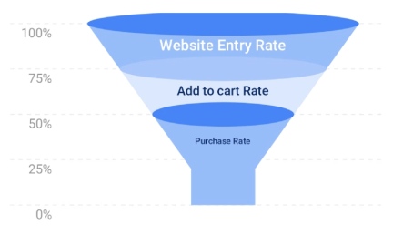

# react-native-funnel-graph

A flexible, SVG-based funnel chart component for React Native to visualize sequential data and conversion rates.

This component is built with `react-native-svg` to render crisp, scalable vector graphics for beautiful data visualizations in your mobile apps.

## Example




crisp vector graphics that look great on all screen sizes.
*   **Data-Driven:** Easily render chart segments by passing an array of data.
*   **Dynamic Labels:** Automatically places and sizes labels within each funnel segment.
*   **Bottleneck Support:** Accurately visualizes the final "bottleneck" stage of a funnel.
*   **Contextual Grid:** Includes optional Y-axis labels and gridlines.

## Installation

1.  **Install the package:**
    ```bash
    npm install react-native-funnel-graph
    ```
    or
    ```bash
    yarn add react-native-funnel-graph
    ```

2.  **Install peer dependencies:** This package requires `react-native-svg`.
    ```bash
    npm install react-native-svg
    ```
    or
    ```bash
    yarn add react-native-svg
    ```
    For iOS, you also need to link the pods:
    ```bash
    cd ios && pod install && cd ..
    ```

## Usage

Here is a basic example of how to use the `FunnelChart` component.

```javascript
import React from 'react';
import { SafeAreaView, StyleSheet } from 'react-native';
import FunnelChart from 'react-native-funnel-graph';

const App = () => {
  // Define the data for the funnel chart
  const funnelData = [
    {
      value: 100,
      label: 'Impressions',
      colors: { side: '#FFB179', top: '#FFD4B2' },
      textColor: '#A05822',
    },
    {
      value: 80,
      label: 'Clicks',
      colors: { side: '#FF8A65', top: '#FFAB91' },
      textColor: '#B71C1C',
    },
    {
      value: 55,
      label: 'Sign Ups',
      colors: { side: '#9ED68A', top: '#C5E1A5' },
      textColor: '#33691E',
    },
    {
      value: 40,
      label: 'Purchases',
      colors: { side: '#81D4FA', top: '#B3E5FC' },
      textColor: '#01579B',
    },
  ];

  return (
    
      
    
  );
};

const styles = StyleSheet.create({
  container: {
    flex: 1,
    backgroundColor: '#fff',
    alignItems: 'center',
    justifyContent: 'center',
  },
});

export default App;
```

## Props

| Prop                  | Type                 | Default                                      | Description                                                                                                    |
| --------------------- | -------------------- | -------------------------------------------- | -------------------------------------------------------------------------------------------------------------- |
| **`data`**            | `Array` (of objects) | `[]`                                         | **(Required)** The dataset for the funnel. See the data object structure below.                                |
| `width`               | `number`             | `350`                                        | The total width of the SVG container.                                                                          |
| `height`              | `number`             | `200`                                        | The total height of the SVG container.                                                                         |
| `yAxisLabels`         | `Array` (of strings) | `['100%', '75%', '50%', '25%', '0%']`         | Labels to display along the Y-axis gridlines.                                                                  |
| `maxFunnelWidthRatio` | `number`             | `0.85`                                       | A value between 0 and 1 representing the width of the funnel's top relative to the chart area.               |
| `minFunnelWidthRatio` | `number`             | `0.2`                                        | A value between 0 and 1 representing the width of the funnel's narrowest point relative to the chart area. |
| `style`               | `object`             | `undefined`                                  | Custom styles to apply to the root `View` container.                                                           |

### Data Object Structure

Each object in the `data` array can have the following properties:

| Key         | Type     | Required | Description                                                                   |
| ----------- | -------- | -------- | ----------------------------------------------------------------------------- |
| `value`     | `number` | Yes      | The numerical value for this segment. Must be in descending order.            |
| `label`     | `string` | Yes      | The text label to display inside the segment.                                 |
| `colors`    | `object` | No       | An object with `side` and `top` color strings (e.g., `{ side: '#CCC', top: '#AAA' }`). |
| `textColor` | `string` | No       | The color for the segment's label text. Defaults to black.                    |

## Contributing

Contributions are welcome! Please feel free to submit a pull request or open an issue if you find a bug or have a feature request.

## License

This project is licensed under the ISC License.